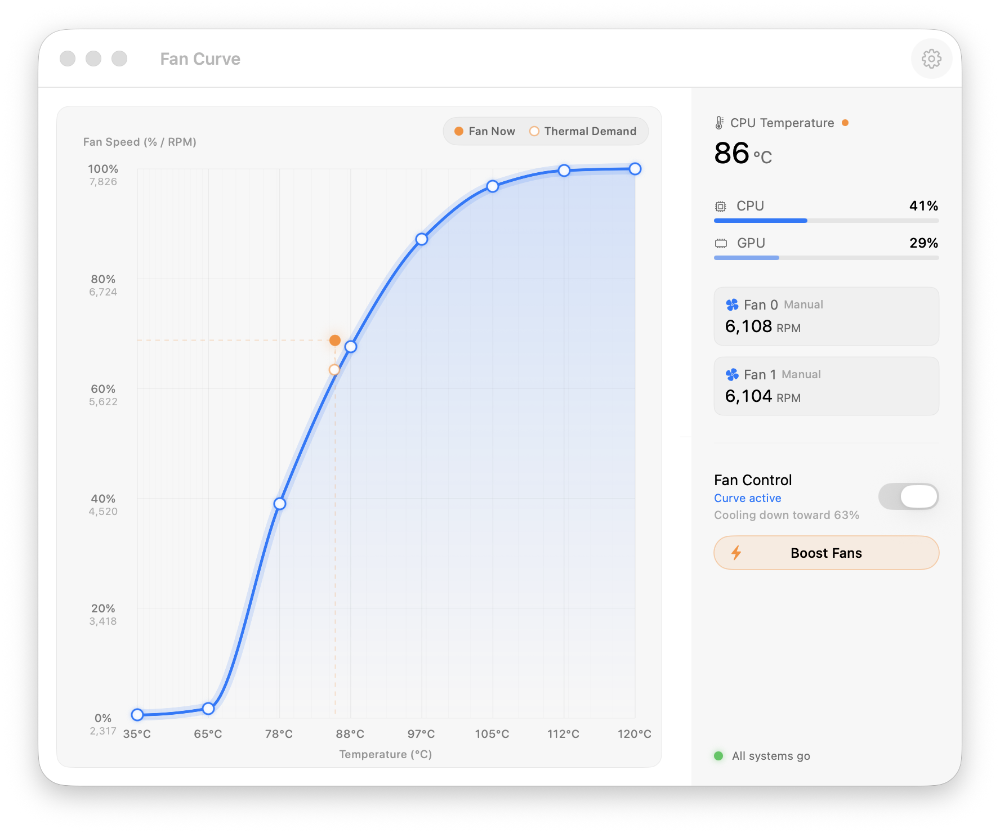

# FanCurve


Advanced fan control for Apple Silicon Macs

[Download](https://github.com/agoodkind/macos-fan-curve/releases) · [MIT License](LICENSE)

FanCurve is a macOS app for editing and applying fan curves on Apple Silicon Macs. It uses [macos-smc-fan](https://github.com/agoodkind/macos-smc-fan) to read sensor data and send fan commands, then applies the selected curve from a background agent.

The app includes a curve editor, live fan and thermal status, curve presets, a sampling flow for learning from the current machine, boost control, and smoothing for fan speed changes. The default curve attempts to follow Apple’s quiet automatic behavior.



## What You Can Do

### Shape the fan response

The main window shows a curve with temperature on the X axis and fan speed on the Y axis. You drag the control points to define exactly how the fans should respond at every temperature. A typical setup keeps them off during light work, brings them up gradually as things warm up, and only runs them hard when the chip is actually under pressure.

### See what is happening right now

While the app is open, two live markers sit on the curve so you can watch the controller work. One tracks the fan's current speed and the other tracks what the controller is currently targeting. When the two are far apart, the controller is holding the fan back to avoid a jarring speed change.

### Keep fans from lurching

The controller applies smoothing to every speed change in both directions, so a short burst of load does not cause a sudden spin-up and the fans do not drop abruptly the moment it is over. The result is a machine that responds to heat without the constant audible surging that makes the stock firmware annoying.

## Download

Get the latest signed and notarized DMG from [GitHub Releases](https://github.com/agoodkind/macos-fan-curve/releases).

Requires macOS 13 or later on Apple Silicon hardware.

## Build From Source

FanCurve uses [Tuist](https://tuist.dev) to generate the Xcode workspace. Use the Makefile rather than running `tuist` or `xcodebuild` directly.

```sh
make install-dependencies
make build
make run
```

`make run` builds the Debug app, installs it to `/Applications/Fan Curve.app`, and launches it. That is the single location the background agent and privileged helper register from, so the app always runs from there. Xcode's Play button runs the DerivedData build for debugging; attach Xcode to the running `/Applications/Fan Curve.app` process to debug the app, or to the background agent process the same way. The privileged helper is a root daemon.

## Contributing

Bug reports and pull requests are welcome. Run `make verify` before opening a PR. If your change touches the fan control loop, read `AGENTS.md` first. It documents the runtime semantics that must be preserved.

### Sharing thermal profiles

FanCurve can learn a curve from your current system by observing how the firmware responds to load across the temperature range. After the sampling run completes, clicking "Share Results" opens a pre-filled GitHub issue with your machine model, macOS version, temperature range, and the full curve data. You do not need to copy anything manually.

Submissions are useful because Apple Silicon variants behave differently enough that a curve tuned on one chip is often a poor starting point on another. The goal is a library of community-sourced presets so new installs start from something sensible for the hardware they are running on.

## License

[MIT](LICENSE)
